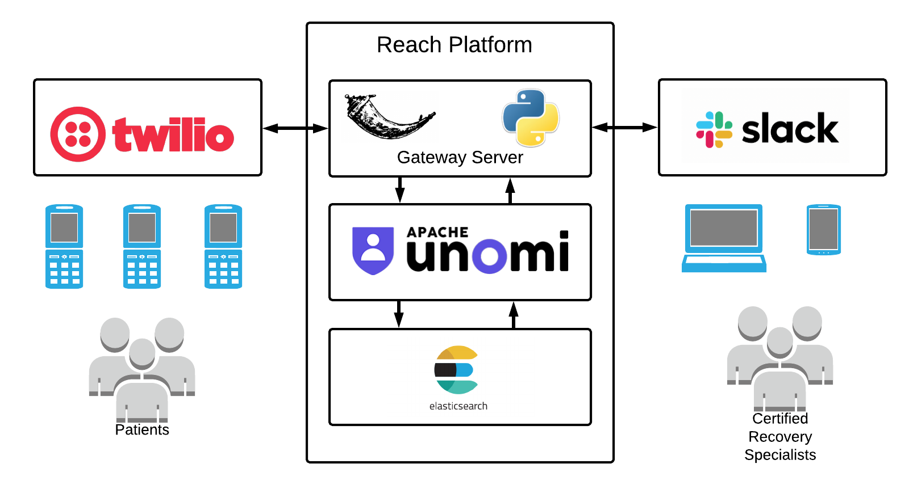

# Reach: SMS Hotline Platform with Integrated Case Management System
This is an SMS Hotline platform developed to facilitate a Warm Handoff to treatment services for overdose survivors. Reach connects people in need with service professionals at any hour of the day and across geographic barriers using SMS.

Reach's integrated case management systems allows for the collection of de-identified data which can be analyzed to find gaps in services, and inform needs assessments and feasibility studies for the expansion and creation of services tailored to community needs.

Together, this SMS hotline and case management systems can help organizations better manage care for their patient population.

# Platform Diagram



# Contributing
Reach is an open source project available under the Apache 2.0 license. Contributions are welcome and encouraged. For detailed information about contributing, check out [CONTRIBUTING.md](./CONTRIBUTING.md).

## Local Development and Testing
To develop and test Reach on your local host follow these instructions:

### OS Dependencies
You will need to install Docker and Docker Compose to run Reach.

### Service Dependencies
You will need to create a Workspace in Slack and an account with Twilio. Before you get started, setup Slack and Twilio as described below:

#### Initial Twilio Setup
Reach sends and receives SMS using Twilio's platform. When setting up, buy 1 or more phone numbers and setup a messaging service.


#### Initial Slack Setup
There should exist an application with a backslash command for `/send`:


### Run Reach using Docker Compose
Run Reach locally by cloning the project and then bringing all the services up with Docker Compose.
```
git clone https://github.com/mikeghen/reach.git
cd reach
cp example.docker-compose.yml docker-compose.yml

# Edit the docker-compose.yml and enter your API credentials
nano docker-compose.yml

# Start services on Docker
docker-compose up
```
:warning: You will need to wait patiently for ElasticSearch and Apache Unomi to start running.

Then you can access the platform at: http://127.0.0.1:5000

### Accessing the Reach Gateway Service and Python Command Line Interactive Runtime Environment
Use `docker-compose` to access the gateway service (the main application for reach) from the command line interface:
```
docker-compose exec gateway bash
```
Once you're inside of the service, you can drop into the flask shell by running:
```
flask shell
```
At this point you can run Python commands.

### Working in the Development Twilio and Slack
Test your application using the Reach Slack and a development project in Twilio (e.g. Reach HRSA Development)

Twilio and Slack need a public endpoint. We can use [ngrok](https://ngrok.com/), download it from the website and move it to your bin:
```
# Place ngrok unix executable into your path something like:
# mv ~/Downloads/ngrok /usr/local/bin/ngrok
# The follow setup:

ngrok authtoken XXXXXXXXXXXXXXXXXXXXXXXXXXX
Authtoken saved to configuration file: /home/ubuntu/.ngrok2/ngrok.yml
ngrok help
```
:information_source: You will need to run `docker-compose` in one terminal and the `ngrok` in another.

:warning: The URL ngrok provides will change unless you figure out how to configure it (please update the docs when someone does)


## Build and Deploy
The `gateway` server is built as a Docker container and pushed into GCR. From there it is deployed to Kubernetes.

Builds and deploys can be handled with commands in `Makefile` or by commits to Github which trigger Google Cloud Builder.
